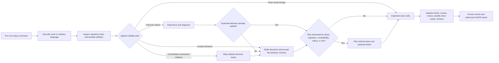
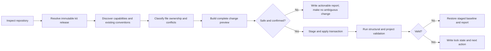

# AI Developer Kit: product and implementation plan

> Status: Accepted  
> Accepted at: 2026-07-26  
> Accepted via: Interactive maintainer review  
> Last updated: 2026-07-26  
> Scope: Workflow, artifacts, distribution, quality gates, cross-agent parity,
> onboarding, and rollout

This is the maintainer-facing product and build contract. It is intentionally
more complete than the developer experience. Developers should receive the
short walkthrough in `.ai/README.md`, not be asked to study this entire file.

## 1. Outcome

Build a governed AI-assisted development system that helps a developer move
from a short natural-language request to reviewed, verifiable code without
having to remember a catalog of skills or recreate project context in every
session.

The product promise is:

> Run one setup command. Describe the work normally. The system inspects the
> repository, chooses the lightest reliable workflow, records only the durable
> context the team needs, builds in verified slices, and prepares the result
> for human review.

The goal is not to produce more code. It is to reduce rework, forgotten checks,
context loss, accidental architectural drift, and the cognitive load of
coordinating AI tools.

### What success means

- A developer can adopt the kit in a new or existing repository with one
  state-aware command and a reviewable diff.
- A developer can begin with phrases such as “add team invitations,” “checkout
  is failing,” or “finish and commit this” without naming an internal skill.
- The system asks the developer only for decisions; it obtains repository facts
  by inspection.
- Tiny changes stay tiny. Material or risky changes gain a durable behavioral
  contract before code is generated.
- Bugs are reproduced and diagnosed before a fix is attempted.
- Deterministic checks, specification review, behavior-preserving
  simplification, and re-verification occur in the correct order.
- `AGENTS.md`, context, specifications, ADRs, and tickets each have one clear
  purpose rather than duplicating the same narrative.
- Codex, Claude Code, and GitHub Copilot produce equivalent workflow outcomes
  even when their invocation syntax and hook support differ.
- Kit releases are immutable, updates are idempotent, and project-owned files
  are never silently replaced.

### Non-goals

- Shipping a collection of every interesting community skill.
- Making every change go through a full spec, plan, ticket, and ADR ceremony.
- Automatically committing, pushing, deploying, publishing, merging, or
  altering an external tracker without explicit authorization.
- Running networked or file-editing AI inside Git pre-commit or pre-push.
- Treating AI review as proof of correctness or a replacement for a human
  reviewer.
- Maintaining separate editable workflow copies for every agent.
- Auto-updating behavioral payloads from an upstream moving `main` branch or
  unreviewed external `latest` package.
- Asking developers to classify a repository as frontend, backend, or
  full-stack.
- Claiming a “10x” productivity result before measuring real team outcomes.

## 2. Decisions to freeze before implementation

These are the recommended product decisions. Implementation should not begin
by reopening them casually; a material change should be proposed explicitly.

| Decision | Consequence |
| --- | --- |
| Design for brownfield adoption first. | A new repository is the easiest form of the same adoption flow, not a separate product path. |
| Expose one setup command: `npx @company/ai-sdlc`. | `init`, `check`, `update`, `doctor`, and `validate` are internal states or maintainer capabilities, not five developer workflows. |
| Let developers speak in normal language. | `develop` is the router; specialist names are implementation details. The assistant acknowledges its mode in plain language. |
| Optimize for agent-first, low-friction use. | Keep durable artifacts structured and easy for assistants to inspect, but require each artifact and gate to earn its cost; routine work stays seamless and avoids ceremony. |
| Keep three optional mental shortcuts: build/fix, finish, and learn. | `develop`, `finish`, and `learn` remain useful front doors, but ordinary wording is the primary interface. |
| Treat every repository as capable of end-to-end work. | The user sees one universal flow; the kit detects actual capabilities and runs only relevant tooling. |
| Use progressive artifacts. | Tiny work can use PR evidence; normal behavior changes use a spec and verification; plans are reserved for multi-slice, migration, compatibility-sensitive, or materially risky work; tickets exist only for independently assignable/resumable slices. |
| Absorb grilling into shaping. | Do not add raw `grill-me`, `grill-with-docs`, or a router such as `ask-matt`. `shape-change` owns fact inspection, focused questions, domain language, and the confirmation gate. |
| Reserve Wayfinder for large, foggy, multi-session discovery. | It is a guarded escalation from `develop`, not the normal feature path and not a command developers must remember. |
| Keep debugging separate from requirements grilling. | A reported failure with an unknown cause enters an evidence-first diagnosis loop. Shaping enters only if expected behavior or policy is unresolved. |
| Put AI simplification in `finish`, after correctness review. | The simplifier runs on verified changed code, then affected checks run again. It never hides inside a Git hook. |
| Keep `.agents/skills` canonical. | Claude, Copilot, Cursor, and other host files are generated or thin adapters; behavioral parity is evaluated. |
| Pin every imported or derived upstream behavior. | Reviewed commit, license, provenance, local deviations, and evaluation evidence are retained. |
| Require humans at judgment and external-action boundaries. | Humans accept material intent, durable decisions, complex plans, and final external actions; routine reads and checks do not create approval fatigue. |

## 3. Evidence from current developer tools

The primary-source review in
[`research/IDE_AI_DEVELOPER_WORKFLOWS.md`](research/IDE_AI_DEVELOPER_WORKFLOWS.md)
found that Codex, GitHub Copilot, Cursor, and Claude Code converge on a common
rhythm:

```text
orient in the repository
  → clarify only what matters
  → plan when complexity warrants it
  → implement a bounded change
  → run executable verification
  → review the diff and evidence
  → let a human accept the result
```

The vendor mechanisms differ, but the useful product lessons are stable:

- persistent repository instructions are not a task plan;
- a host's Plan mode is not automatically a durable product specification;
- prompt guidance is not deterministic enforcement;
- reusable procedures belong in progressively loaded skills rather than an
  oversized root instruction file;
- debugging should be evidence-first;
- native checkpoints are useful local recovery, not team history or a
  substitute for Git;
- AI review is another signal, not a correctness certificate.

The research reflects official product guidance, not independent telemetry
about how all developers behave. We should evaluate the workflow with our own
team rather than copy an IDE's interface or productivity claims.

## 4. Current repository: foundation and gaps

At plan acceptance, the repository already had a credible workflow kernel. The
ordinary validator passed with 13 skills, 26 routing cases, and 13 behavior
cases.

| Area | Already present | Missing product work |
| --- | --- | --- |
| Governance | Central kit ownership, quality rubric, pinned provenance, deterministic-hook policy | Release and migration implementation |
| Repository contract | `AGENTS.md` with authorization, risk tiers, workflow router, and verification order | Brownfield co-ownership/managed-region policy and the updated natural-language route |
| Skills | `develop`, `finish`, `learn`, engineering primitives, security and UI profiles | Bug and initiative routing in `develop`; complete grilling/context/ADR behavior |
| Cross-agent support | Canonical `.agents/skills`, Claude command adapters, Copilot pointer | Generated adapter parity, Cursor decision, real cross-surface evaluations |
| Artifacts | Templates for spec, plan, tasks, and verification | Progressive creation rules, context model, ADR lifecycle, ticket source-of-truth rule |
| Evaluation | Structural validator plus routing and behavior case definitions | Executable end-to-end dialogues, two positive/negative cases per skill, safety and brownfield fixtures |
| Adoption | Manual copy command and checklist | One-command inspect/preview/apply/update/conflict workflow |
| Updates | Upstream movement checker | Project ownership manifest, immutable package release, migrations, safe merge and rollback |
| Local quality | Policy for pre-commit, pre-push, CI, review, and simplification | Capability discovery, hook composition, and configured project commands |
| Human onboarding | Adoption checklist | A developer walkthrough with realistic dialogues and visible gates |

One practical prerequisite is outside the product design: this workspace is not
currently a Git worktree. Before implementation and release work, it should be
initialized as, or moved into, the intended repository so that diffs, commits,
update fixtures, and PR-based governance can be exercised honestly.

## 5. The developer's mental model

The developer should learn one sequence:

```text
Set up once → Ask normally → Agree on important behavior → Build → Finish
```

They may use any of these phrases:

- “Help me build …”
- “This behavior is broken …”
- “I am not sure how this should work …”
- “Pause and teach me …”
- “Finish this,” “get this ready for review,” or “commit this.”

They should not need to know `shape-change`, `diagnose-failure`,
`implement-slice`, `review-change`, `simplify-change`, `grilling`,
`simulate-discussion`, or Wayfinder.

The assistant makes routing visible without exposing taxonomy:

- “I’m checking the existing behavior before asking questions.”
- “There is one product decision we need to settle.”
- “I’m diagnosing the failure before changing code.”
- “This is a larger initiative, so I recommend mapping its decision tracks
  before we create feature specs.”
- “The implementation is ready for deterministic checks and review.”

The developer brings the problem, desired outcome, or uncertainty. They are not
responsible for selecting the workflow or designing routine implementation
details. The assistant owns repository investigation, workflow selection,
technical legwork, and a recommendation. The developer owns product policy,
acceptable risk, durable trade-offs, and external actions.

### How the agent handles “I do not know how”

Uncertainty is classified before it is escalated:

1. Inspect repository facts first.
2. Ask the developer only when observable behavior, policy, risk, or a durable
   trade-off is unresolved.
3. Make routine reversible engineering choices from repository evidence.
4. Use bounded research for an external fact and a bounded prototype for a
   measurable question.
5. Use simulated perspectives when one consequential decision has several
   defensible answers; recommend a choice, but leave it to the human.
6. Propose Wayfinder only when discovery contains multiple coordinated outcomes
   or decision tracks that cannot remain one coherent spec or session.

Developer uncertainty by itself is not a Wayfinder signal. The canonical
normal-language examples and near-neighbor routing boundaries live in
`repo-template/evals/dialogue-cases.json` and render into the draft
walkthrough.

### End-to-end developer flow



Every completed code change receives an adaptive finish before it is described
as ready. For a tiny change, that may be only the focused deterministic check,
a bounded diff review, and a no-op simplification assessment. A commit, PR, or
material feature receives the full configured finish path.

### Internal routing contract

The system always starts by reading the active instructions, `ai-sdlc.yaml`,
relevant code and tests, existing specs, domain context, and relevant ADRs.
Then it uses the following routes.

| Signal | Visible response | Internal route | Exit condition |
| --- | --- | --- | --- |
| Explanation or codebase orientation only | “I’m orienting to the repository; I won’t change files.” | Read-only explanation | Evidence-backed answer |
| Clear, local, reversible, low-risk change with no consequential authorization, data, safety, migration, compatibility, or public-contract impact | “This is bounded; I’ll make the smallest change and run its focused check.” | `implement-slice` from an inline change brief, without a feature folder | Behavior and focused verification complete |
| Reported broken behavior, cause unknown | “I’m diagnosing before editing.” | `diagnose-failure`; remain read-only unless a fix was also requested | Root cause established, or causal fix verified when authorized |
| Missing facts likely in the repository | “I’ll inspect the existing behavior first.” | Repository inspection | Facts established without asking the human |
| Missing external or version-sensitive fact | “I need to verify the platform behavior from its primary source.” | Bounded research | Cited evidence and limitations recorded |
| Unclear intent, scope, policy, terminology, or acceptance | “There is a decision to settle.” | `shape-change` with grilling behavior | Shared understanding explicitly confirmed |
| One contested decision has several defensible viewpoints | “I’ll compare the consequences before recommending a choice.” | Simulated expert discussion inside shaping | Recommendation made; human chooses |
| An empirical question is cheaper to test than debate | “A small experiment can answer this more reliably.” | Throwaway prototype/spike | Named question answered; prototype not treated as production |
| Unresolved discovery contains multiple coordinated outcomes or decision branches that cannot remain one coherent spec/session | “This is an initiative rather than one feature.” | Guarded Wayfinder escalation | Each track is coherent enough for its own spec |
| Accepted behavioral contract; planning is warranted by multiple increments, migration, compatibility, rollout, or material risk | “I’ll make the technical order and review gates explicit before building.” | `plan-change` and optional tickets | Accepted dependency-aware implementation plan |
| Accepted bounded slice | “I’m implementing the accepted increment.” | `implement-slice` | Criterion mapped to deterministic evidence |
| Work substantially complete or commit/PR requested | “I’ll finish verification and review before the external action.” | `finish` | Readiness verdict and evidence |
| A knowledge gap blocks the current decision | “I’ll preserve our place, teach the concept, and return here.” | `learn`/handoff | Understanding checked and original workflow resumed |

### Escalation and return rules

1. Inspect before interviewing. Never ask the developer for a fact the
   repository can answer.
2. Ask humans about intent, policy, priority, acceptable risk, and real
   trade-offs.
3. Ask one material question at a time by default. Include a recommendation and
   its trade-off.
4. Use simulated discussion only inside a contested decision; it advises the
   human and never decides policy.
5. Use a prototype only to answer one named uncertainty. Discard or clearly
   isolate it.
6. Escalate to Wayfinder only when unresolved discovery contains multiple
   coordinated outcomes or decision branches that cannot remain one coherent
   spec or one discovery session. Large implementation alone is not enough.
7. Do not create implementation tickets from a raw requirement.
8. If implementation reveals a scope-changing fact, stop the affected slice,
   return to shaping, update the accepted artifact, and reconcile downstream
   work.
9. If diagnosis reveals that expected behavior is unclear, pause the fix and
   enter shaping for that decision only.
10. Do not proceed from shaping to implementation until the developer confirms
    the behavioral contract.
11. Risk can make a route stricter, but confidence cannot make it looser.
    Authentication, billing, sensitive data, destructive migrations, and
    domain-critical rules retain their configured human review gates.
12. “Diagnose” or “find the cause” stops after evidence and the causal finding.
    “Diagnose and fix” may continue to a regression test and the smallest
    causal edit, followed by verification.

## 6. Artifact model

Each artifact should answer a different question.

| Artifact | Question answered | Ownership and lifecycle |
| --- | --- | --- |
| `AGENTS.md` | How must agents work in this repository? | Co-owned: project facts and constraints plus a small delimited kit-managed workflow region; concise and reviewed |
| Nested `AGENTS.md` | What genuinely differs in this subtree? | Project-owned; created only for a real scoped override |
| `.ai/README.md` | How does a human developer use the kit here? | Kit-managed walkthrough; installer prints a direct link |
| `ai-sdlc.yaml` | Which project commands, paths, capabilities, risk rules, and gates apply? | Project-owned after adoption; the installer proposes initial values but updates do not overwrite them |
| `.ai/kit.lock.json` | Which exact kit release and managed baselines are installed? | Machine-managed; exact CLI/release version, reviewed payload digest, adapters, migrations, managed paths, and baseline hashes |
| `.agents/skills/<name>/SKILL.md` | How is one reusable workflow executed? | Kit-managed when shipped by the organization; unrecognized project skills are preserved |
| Host adapters | How does this agent reach the canonical contract and skills? | Kit-managed thin files or delimited regions; never an independent policy copy |
| `CONTEXT.md` | What do domain-specific terms mean? | Project-owned glossary only; created lazily when the first term needs resolution |
| `CONTEXT-MAP.md` | Which bounded contexts exist and how do they relate? | Project-owned; only for genuinely multi-context repositories |
| Product and operational docs | How do users, integrators, and operators use or support changed behavior? | Project-owned; updated only when the change materially affects their contract |
| `initiatives/<slug>/map.md` | Which unresolved outcomes and decision tracks must be coordinated across discovery sessions? | Project-owned, created only by guarded initiative mapping, and closed when every track is resolved, deferred, or split into accepted specs |
| `specs/<slug>/spec.md` | What observable behavior are we agreeing to build? | Project-owned behavioral contract; accepted before material implementation |
| `specs/<slug>/verification.md` | How will we prove it, and what evidence did we obtain? | Drafted with the spec and completed through implementation/finish |
| `specs/<slug>/plan.md` | In what technical order will an accepted change be implemented? | Optional and mutable; created for risky or multi-slice work |
| Tracker tickets | What independently verifiable slice can be assigned or resumed? | Created after spec acceptance and only with explicit authorization to mutate the tracker |
| `docs/adr/NNNN-<slug>.md` | Why was a durable architecture choice made? | Project-owned historical decision; accepted content is not rewritten |
| `artifacts/ai/handoffs/` | What transient state is needed to resume one session? | Ignored, redacted, disposable after durable artifacts are current |
| Pull request | What changed and is it ready to merge? | Human-reviewed diff and summarized verification evidence |

The target project-owned `ai-sdlc.yaml` schema persists brownfield mappings and
contains no kit release version:

```yaml
schema_version: 2

commands:
  format: []
  lint: []
  typecheck: []
  unit_test: []
  integration_test: []
  build: []
  security: []

paths:
  specs: specs
  decisions: docs/adr
  initiatives: initiatives
  context_entry: CONTEXT.md
  transient_handoffs: artifacts/ai/handoffs

artifact_profiles:
  spec: ai-sdlc-v1
  adr: ai-sdlc-v1
  context: glossary-v1
```

For a multi-context repository, `context_entry` points to
`CONTEXT-MAP.md`. A brownfield repository may select a supported ADR/context
profile and alternate paths. Unsupported conventions are reported rather than
rewritten.

### Progressive artifact ladder

| Level | Use when | Required artifacts | Deliberately skipped |
| --- | --- | --- | --- |
| 0 — Routine | Clear, local, reversible, low-risk edit | Request/PR intent plus commands and results | Feature folder, plan, tickets, ADR |
| 1 — Bounded behavior | A normal feature or a bug whose expected behavior needs a contract | `spec.md` and `verification.md` | `plan.md` and tickets unless multiple slices help |
| 2 — Multi-slice change | Several dependency-ordered increments, compatibility work, migration, or material risk | Level 1 plus `plan.md`; tracker tickets when useful | Wayfinder unless discovery itself is large/foggy |
| 3 — Initiative | Unresolved discovery has multiple coordinated outcomes or decision branches that cannot remain one coherent spec/session | Initiative map/decision tracks first; one spec per coherent outcome later | Premature implementation tickets |

ADRs and domain context are orthogonal to the levels:

- Update context only when stable domain language changes.
- Create an ADR only when the three-part decision gate passes.
- A clear bug can use a regression test and verification evidence without a new
  feature spec or ADR.
- An unclear bug policy returns to shaping and may then need a spec.

### Specs, plans, and tickets

- A spec records observable intent, scope, scenarios, acceptance criteria,
  invariants, failure behavior, exclusions, risk, and unresolved decisions.
  Implementation choices appear only when they are genuine constraints.
- Verification is designed with the spec, not written after the code. Every
  acceptance criterion has an intended evidence source.
- A plan records code seams, vertical slices, compatibility/rollout, risks, and
  checks. Its acceptance and amendment rules are defined below.
- Tickets are projections of an accepted plan, not a second specification.
  Each ticket links to the spec, delivers observable behavior, names the
  criteria it covers, states dependencies, and includes deterministic
  verification.
- Avoid layer-only tickets such as “build database,” “build backend,” and
  “build frontend.” Each slice crosses the boundaries necessary to prove one
  usable behavior.
- Use `tasks.md` only when a project deliberately chooses repository-local task
  tracking. When GitHub or another tracker is the execution source of truth, do
  not maintain a duplicate local checklist.

### Spec and plan acceptance

Acceptance must survive a new chat or developer. Specs use a lightweight
lifecycle:

```yaml
status: draft # draft | accepted | superseded
accepted_at:
accepted_via:
superseded_by:
```

- Only explicit human confirmation changes a spec from `draft` to `accepted`.
  Record the date and the durable review reference when one exists, such as a
  PR or issue; an explicitly recorded interactive review is allowed before the
  first PR.
- A material edit to accepted behavior, scope, acceptance criteria, invariant,
  failure policy, or risk returns the spec to `draft`.
- Returning a spec to draft pauses affected implementation and reconciles its
  plan, tickets, and verification mapping.
- A replacement behavior contract creates a new spec or revision and marks the
  old one `superseded`; history is not silently rewritten.
- Pure typo, formatting, or link corrections do not revoke acceptance.

Plans that require a human gate use the same `draft`/`accepted` metadata with
`accepted_at`, `accepted_via`, and a reference to the accepted spec. Local
technical seam/order refinements remain allowed under the existing acceptance.
A material change to risk, rollout, dependencies, external effects, or human
gates returns the plan to `draft`, pauses execution, reconciles tickets, and
requires re-acceptance. The agent never marks its own spec or plan accepted.

### Consequential documentation

- Shaping identifies which user, API, integration, operational, migration, or
  support contracts the change affects.
- Each implementation slice updates its consequential docs with the behavior,
  rather than leaving a final documentation phase.
- Deterministically generated reference docs are regenerated by the configured
  project command.
- `finish` treats a public or operational behavior change with stale required
  docs as not ready.
- Do not generate generic documentation for an internal change that has no
  documentation consumer.

### Domain context

`CONTEXT.md` is a glossary, not a project dump, spec, architecture document, or
scratch pad. Definitions should be short, project-specific, and opinionated
about canonical terminology. If a developer says “account” while the existing
context distinguishes a `Customer` from a `User`, the workflow should surface
that conflict during shaping.

For most repositories, one root `CONTEXT.md` is enough. Add
`CONTEXT-MAP.md` and context-local glossaries only when independent bounded
contexts and their relationships are real. Files are created lazily; the
installer should not generate empty context documents.

### Initiative maps

`initiatives/<slug>/map.md` is the durable state for the guarded Wayfinder
route. It contains the intended outcomes, dependency-ordered decision tracks,
settled and open decisions, evidence/research/prototype links, the current
branch, and the next branch to resume. It is not a product spec and does not
contain premature implementation tickets. Each resolved coherent outcome links
to its own accepted feature spec; the map becomes `completed`, `paused`, or
`superseded` when coordination ends.

## 7. ADR lifecycle

An ADR is warranted only when all three conditions are true:

1. The decision is hard or costly to reverse.
2. The chosen result would be surprising without its context.
3. Real alternatives and a meaningful trade-off existed.

If any condition is false, keep the information in the spec, plan, code, or PR.
ADRs should be atomic: one decision and one scope. Atomic decisions make later
supersession unambiguous.

### Minimal format

```markdown
---
status: proposed
date: YYYY-MM-DD
supersedes: []
superseded_by: []
related_adrs: []
related_specs: []
---

# Use domain events between Ordering and Billing

<One to three paragraphs covering context, decision, why, and important
consequences. Add considered options only when future readers need them.>
```

### Status and action rules

| Situation | Action |
| --- | --- |
| The decision is still being discussed | Keep one ADR `proposed`; edit it freely |
| The human accepts the decision | Set it to `accepted`; from then on the decision body is historical |
| An option was considered but never chosen | Set the proposed ADR to `rejected` if remembering the analysis has value |
| A new decision replaces the same decision in the same scope | Create a new ADR; set the old one to `superseded`; add bidirectional links |
| The decision is no longer relevant and has no direct replacement | Set it to `deprecated` and add a short dated reason |
| A later decision extends rather than replaces the old one | Create a related ADR; leave the original `accepted` |
| Only a reversible implementation detail changes | Update the spec/plan/code; do not create or supersede an ADR |
| A typo, broken link, or later observation is found | Correct metadata or append a dated note; do not rewrite the accepted rationale as if history changed |

The old ADR remains in the repository. Supersession changes status/link
metadata, not the historical body. The new ADR states why the old decision no
longer fits.

### ADR participation in the workflow

- `develop` locates relevant active ADRs before proposing behavior or
  architecture.
- `shape-change` detects whether the request follows, extends, conflicts with,
  or replaces an existing decision.
- The spec links to relevant ADRs instead of copying architectural rationale.
- Plans and tickets respect accepted ADRs.
- `implement-slice` stops if the accepted implementation would contradict an
  active ADR or requires a new durable choice.
- `diagnose-failure` uses ADRs to distinguish an implementation defect from
  intentional behavior.
- `finish` checks whether the diff introduced or superseded a qualifying
  architectural decision without recording it.
- The validator checks valid statuses, unique numbers, existing links, and
  bidirectional supersession.

### ADR example: superseding rather than rewriting

Assume `ADR-0006` says Ordering calls Billing synchronously over HTTP. A new
availability requirement makes that coupling unacceptable.

1. `develop` discovers `ADR-0006` while inspecting the affected boundary.
2. `shape-change` establishes that the new requirement replaces the same
   integration decision rather than merely adding a consumer.
3. The assistant proposes `ADR-0014: Use domain events between Ordering and
   Billing`, with `supersedes: [0006]`.
4. The developer accepts the trade-off.
5. `ADR-0006` becomes `superseded` and links to `0014`; its original text stays
   intact.
6. The feature spec links to `ADR-0014`, and the plan includes migration,
   compatibility, rollback, and verification.

If instead a retry bug violates `ADR-0006`'s existing idempotency requirement,
the workflow adds a regression test and fixes the violation. It does not create
another ADR.

## 8. Dialogue demonstrations

These dialogues are the human-readable source scenarios for the walkthrough
and future structured acceptance fixtures. After Step 4, the canonical
executable version lives in `evals/dialogue-cases.json`; selected transcripts
are rendered into the walkthrough by scenario ID so they cannot drift into
independent editable copies.

### Dialogue 1: adopt an existing repository

```text
Developer terminal:
$ npx @company/ai-sdlc

Kit:
Existing repository detected. No kit installation is recorded.

I inspected:
- pnpm workspace with a React application and Node service
- PostgreSQL migrations
- existing AGENTS.md and Copilot instructions
- Husky pre-commit and GitHub Actions

Proposed adoption:
- add the reviewed canonical workflow skills and thin host adapters
- add the human walkthrough and spec templates
- add a small managed workflow region to AGENTS.md
- preserve the existing project rules and hooks
- map existing lint, typecheck, test, and build commands into ai-sdlc.yaml

The existing instructions and hook policy are compatible with the kit.

No files have changed. Apply this adoption plan? [y/N]

Developer:
y

Kit:
Adoption applied and validated. Existing project guidance and hooks were
preserved.

Next: ask your coding assistant, “Give me an overview of this project. Do not
change files.”
Walkthrough: .ai/README.md
```

Behind the scenes:

- The command follows inspect → preview → confirm → apply → validate.
- It detects capabilities; it never asks whether the project is frontend,
  backend, or full-stack.
- Existing instructions, hooks, and CI are mapped and preserved.

Must not happen:

- blind copying over `AGENTS.md`;
- replacing a hook;
- applying a disputed policy silently;
- requiring five follow-up setup commands.

### Dialogue 2: a fuzzy feature in a brownfield project

```text
Developer:
Add team invitations.

Assistant:
I’ll inspect the current organization roles, user creation flow, email
provider, and related specs before asking you for product decisions.

Assistant:
I found Owner, Admin, and Member roles. Owners can currently change roles;
Admins cannot. The repository does not define who may invite a new member.

There is one policy decision to settle first. I recommend allowing Owners and
Admins to invite, while only Owners may invite another Owner. That preserves
the existing authority boundary. Should we use that rule?

Developer:
Yes.

Assistant:
For expired invitations, I recommend a generic expired state with a “request a
new invitation” action rather than revealing whether the email already has an
account. Accept?

Developer:
Yes, use a 72-hour expiry.

Assistant:
I have enough shared intent. I’ll draft a spec covering authorization,
single-use tokens, expiry, resend behavior, existing-user behavior, failure
states, and acceptance evidence. I will not implement until you accept it.

Developer:
The spec looks right. Continue.

Assistant:
This needs three independently verifiable slices. I’ll draft the dependency
order and verification for your review before implementation.

Assistant:
The plan is ready. No external tickets have been created. Do you accept the
plan, and do you want GitHub issues or repository-local execution only?

Developer:
Accept the plan. Keep execution local for now and start the first slice.

Assistant:
I’ll implement the first accepted slice and show its evidence before moving to
the next.
```

Internal route:

```text
develop → inspect facts → shape-change → accept spec
        → plan-change → implement-slice × N → finish
```

Artifacts and gates:

- A domain term is added to `CONTEXT.md` only if “Invitation” needs a stable,
  project-specific definition.
- `spec.md` and `verification.md` are created before code.
- `plan.md` appears because multiple slices help. External tickets appear only
  if the developer separately authorizes creation in the configured tracker.
- No ADR is created merely for a 72-hour expiry; it is reversible product
  policy unless project evidence makes it an architectural constraint.
- The human accepts both the behavioral spec and the multi-slice plan before
  implementation.

### Dialogue 3: a clear, tiny change

```text
Developer:
Change the settings dialog button from “Save” to “Save changes” and update the
test.

Assistant:
This is a clear, local, reversible, low-risk change. The request itself is a
sufficient inline change brief. I’ll inspect the component and existing test,
make the smallest edit, and run the focused UI test. It does not need a feature
folder, plan, ticket, or ADR.

Assistant:
Updated the label and assertion. The focused test passes, the bounded diff
review found no unrelated change, and simplification was unnecessary.
Readiness: ready.
```

Internal route:

```text
develop → implement-slice from inline brief → adaptive finish
```

Must not happen:

- grilling the developer about unrelated UI policy;
- generating four planning files;
- refactoring the dialog while touching the label.

### Dialogue 4: debug a failure in an existing project

```text
Developer:
Some checkout retries charge the customer twice. Find the cause and fix it.

Assistant:
I’m diagnosing the failure before changing product code. I’ll establish the
expected behavior, create the tightest red-capable reproduction, and inspect
the checkout boundary, tests, history, specs, and relevant ADRs.

Assistant:
I reproduced the duplicate charge when the first response times out after the
provider accepts payment. ADR-0009 already requires idempotent payment
processing. The retry path generates a new idempotency key, so the provider
correctly treats it as a second charge.

I’ll add a regression test around the retry boundary, make the smallest causal
fix so retries reuse the operation key, and rerun the focused and affected
checkout checks.

Assistant:
The regression was red before the fix and is now green. The affected checkout
suite passes. The bounded diff review matches the existing idempotency
decision, the simplification assessment found nothing useful to change, and
the regression/command evidence is recorded for review.

Readiness: ready. No ADR was needed because the implementation violated an
existing accepted decision.
```

Internal route:

```text
develop → diagnose-failure → regression test → causal fix
        → affected checks → finish
```

Must not happen:

- guessing and patching the first suspicious line;
- starting a requirements interview before checking reproducible facts;
- rewriting the ADR to describe the bug;
- broad logging or permanent instrumentation left behind.

If the developer had said “find the cause, but do not fix it,” the dialogue
would stop after the reproduction, evidence, causal chain, confidence, and
unresolved alternatives. No regression-test or product-code edit would be
authorized.

### Dialogue 5: a contested architecture decision

```text
Developer:
Should notifications be sent directly from the request or through an outbox?

Assistant:
I’ll first inspect the current transaction boundary, delivery guarantees,
traffic, operational tooling, and any existing decision. Then I’ll compare the
credible choices.

Assistant:
This is durable, difficult to reverse after producers depend on it, and has a
real reliability/operability trade-off.

Product argues for direct delivery: it is simpler to explain and appears to
complete immediately. Operations counters that a provider timeout makes
request success ambiguous and offers no durable backlog to inspect or replay.
Application engineering agrees with the simplicity concern, but notes that the
existing database transaction can atomically write an outbox record without
introducing a broker.

The synthesis is a transactional outbox with an asynchronous dispatcher. It
adds a worker and backlog monitoring, but closes the post-commit delivery gap
without introducing a message broker at the current scale. I recommend that
direction. Do you accept it as the architecture decision?

Developer:
Yes.

Assistant:
The answer settles the discussion but does not authorize a repository edit.
This decision passes the durable, surprising, real-trade-off gate. Would you
like me to draft a proposed ADR for review?

Developer:
Draft it.

Assistant:
The ADR is drafted with status proposed. No spec or code has changed. Do you
accept the ADR, and should we then shape the notification feature?

Developer:
Accept the ADR and shape the feature.

Assistant:
I’ll mark the ADR accepted, then create a separate behavioral spec for your
review. The spec will link to the ADR rather than repeat its rationale, and it
will require its own acceptance before implementation.
```

Internal route:

```text
read-only architecture question → inspect → shape-change
        → simulated expert discussion inside one decision
        → human choice → authorized ADR draft → ADR acceptance
        → separate spec shaping and acceptance
```

The simulated discussion informs the decision; it never replaces human
ownership of policy or architecture.

### Dialogue 6: supersede an accepted ADR

```text
Developer:
The new availability requirement means Ordering must stop calling Billing
synchronously. Move it to events.

Assistant:
I found ADR-0006, which explicitly selects synchronous Ordering-to-Billing
HTTP. This request replaces the same integration decision; editing that ADR
would erase why the old system was built that way.

I recommend a new ADR that supersedes ADR-0006, with migration and rollback in
the implementation plan. The old ADR will remain historical and link to the
new one. Shall I shape the event guarantees and failure policy first?

Developer:
Yes.

Assistant:
I’ll settle delivery, ordering, idempotency, recovery, and ownership one
decision at a time. After shared understanding, I’ll ask before drafting the
replacement ADR.

Assistant:
The decisions are settled. May I draft ADR-0014 as proposed? ADR-0006 will
remain accepted until you explicitly accept the replacement.

Developer:
Draft it.

Assistant:
ADR-0014 is proposed and links to ADR-0006. Please review it.

Developer:
Accept ADR-0014.

Assistant:
I’ll atomically mark ADR-0014 accepted, mark ADR-0006 superseded, and add both
links. I’ll then draft the migration spec for a separate acceptance gate.
```

Artifacts and gates:

- `ADR-0006` body remains unchanged.
- `ADR-0014` records the new trade-off and `supersedes: [0006]`.
- Before acceptance, `0006` remains accepted and `0014` remains proposed.
- Acceptance updates both statuses and links as one coherent edit, and both
  links must validate.
- A spec describes observable migration behavior; a plan handles
  expand-contract, rollout, and rollback.

### Dialogue 7: a large, foggy initiative

```text
Developer:
Build one customer platform for web, mobile, partner APIs, regional data
residency, and usage-based billing.

Assistant:
This is not one feature. It contains several outcomes, policy decisions, and
research tracks that will span sessions. Writing one large spec or creating
implementation tickets now would mix unresolved decisions.

I recommend mapping the initiative first. The initial decision tracks are:
1. customer and tenant boundaries;
2. identity and authorization;
3. regional data ownership and movement;
4. usage metering and billing invariants;
5. channel/API contracts;
6. migration and rollout.

I will keep these as decision tracks, use research or prototypes where facts
are missing, and bring each coherent outcome back for its own accepted spec.
Proceed with that initiative map?

Developer:
Proceed.

Assistant:
I’ll start with the tenant boundary because it constrains the other tracks. No
implementation tickets will be created until a track has accepted behavior.
```

Internal route:

```text
develop → guarded Wayfinder
        → dependency-ordered decision tracks
        → research / prototype / shaping per track
        → one accepted spec per coherent outcome
        → tickets only for executable slices
```

Must not happen:

- a single enormous PRD/spec;
- frontend/backend/database task lists before integration behavior is known;
- Wayfinder for an ordinary one-session feature.

### Dialogue 8: finish before commit

```text
Developer:
Looks good. Commit it.

Assistant:
That authorizes the commit, but I’ll finish the change first: establish the
intended diff, run configured deterministic checks, review it against the spec
and repository standards, simplify only verified changed code, rerun affected
checks, and perform a final diff review.

Assistant:
Typecheck, unit tests, integration tests, and build pass. Review found one
blocking retry edge case; I fixed it and reran the affected tests. The
simplification pass removed a duplicate local branch without changing
behavior, so I reran the focused tests and final diff review.

Readiness: ready.
Evidence is recorded in specs/team-invitations/verification.md.
I will now create the requested commit. I will not push or open a PR unless
you ask.
```

Internal route:

```text
commit request → finish
  → deterministic checks
  → spec + standards review
  → authorized fixes and recheck
  → behavior-preserving simplification and recheck
  → final diff review
  → readiness verdict
  → explicitly authorized commit
```

AI review and simplification are deliberately outside pre-commit. A human who
commits without using the assistant will still receive deterministic hook and
CI enforcement, but the product must not claim it can force an AI skill in that
case.

### Dialogue 9: learn without losing the workstream

```text
Developer:
Pause. I do not understand expand-contract well enough to approve this
migration plan. Teach me, then come back to the decision.

Assistant:
I’ll preserve the accepted spec, evidence, current plan, and exact pending
decision in a redacted handoff. Then I’ll teach only the expand-contract idea
needed here.

Assistant:
[Explains the old-compatible addition, dual-read/write transition, cutover,
and removal with one project-specific example.]

If version N and N+1 run together during deployment, which schema change would
let both versions continue to serve requests?

Developer:
Add the nullable column first; do not make the old reader depend on it.

Assistant:
Exactly. I’ll append that conclusion to the handoff and return to the rollout
order in the migration plan.
```

The teaching detour does not become permanent project documentation unless it
reveals a stable constraint or domain decision.

### Dialogue 10: capture durable project guidance

```text
Developer:
We keep rediscovering that migrations must support two application versions
during rolling deploys. Make sure future agents know this.

Assistant:
This is a stable, repository-wide constraint and repeated friction supports
promoting it into durable guidance. I’ll propose a concise AGENTS.md rule,
reference the repository’s migration verification command, and add a behavior
case that would fail if a future workflow proposes a one-step breaking
migration.

I will change it through the current reviewable diff; I will not save it as
private chat memory.
```

Stable facts belong in the closest project scope. Detailed procedures belong
in a skill or linked guide, not in an ever-growing `AGENTS.md`.

### Dialogue 11: update with a local conflict

```text
Developer terminal:
$ npx @company/ai-sdlc

Kit:
Installed: 0.3.0
Available reviewed release: 0.4.0

Preview:
- 11 untouched managed files can update safely
- 2 new files can be added
- 1 managed file, .agents/skills/shape-change/SKILL.md, was changed locally
- project-owned ai-sdlc.yaml and specs are preserved

I cannot prove that the local shape-change edits and the release behavior are
compatible. No changes have been applied.

The conflict report is printed below; no report file was written. Resolve the
project policy through a reviewed change, then run the same command again.
```

The single command does not mean an unsafe automatic mutation. It means one
state-aware entry point with a safe stop condition.

### Dialogue 12: the outcome is known, but the implementation approach is not

```text
Developer:
I want users to access recent records offline, but I have no idea how to
implement it.

Assistant:
I’ll inspect the current data-loading, caching, authentication, and mutation
paths before asking you to make decisions.

Assistant:
This is one coherent feature, not an initiative. The product decision is
whether offline access is read-only or also queues writes. I recommend
read-only first because queued writes require synchronization and conflict
policy. Which behavior do you need?

Developer:
Start with read-only offline access.

Assistant:
I’ll own the routine implementation choices. If repository evidence cannot
settle a measurable technical question, I’ll run a bounded prototype. If one
durable choice has several defensible options, I’ll compare their consequences
and bring you a recommendation.

I’ll now draft the behavior and verification contract for review. I will not
implement until you accept it.
```

Internal route:

```text
develop → inspect repository
        → shape unresolved product behavior only
        → resolve technical uncertainty with evidence
            → repository convention: agent decides
            → external fact: bounded research
            → empirical question: bounded prototype
            → contested durable choice: simulated perspectives, human decides
        → accept spec → conditional plan → implement → finish
```

Wayfinder is not triggered merely because the developer is unsure how to
implement something. It is proposed only when discovery contains multiple
coordinated outcomes or decision branches that cannot remain one coherent spec
or discovery session.

Must not happen:

- asking the developer to design routine implementation details;
- turning one coherent feature into an initiative;
- debating a question that repository evidence or a small experiment can
  answer;
- letting simulated perspectives make the final policy or architecture choice.

## 9. Quality and enforcement model

The workflow has four distinct layers. Each layer should do only work suited to
its reliability and latency.

| Layer | Purpose | Examples |
| --- | --- | --- |
| Edit/iteration | Fast feedback on the current slice | formatter, focused lint, focused test, local preview |
| Pre-commit | Cheap deterministic changed-file protection | formatting check, lint-staged, secret scan, generated-file consistency |
| Pre-push | Broader deterministic confidence | typecheck, affected tests, build, migration validation |
| CI/protected branch | Organization enforcement | full tests, security scans, policy, evidence presence, required reviewers |
| `finish` | Contextual AI-assisted readiness | spec/standards review, triggered security/UI review, simplification, evidence summary |

### Required `finish` order

1. Establish the intended diff and preserve unrelated user changes.
2. Read the accepted spec, plan, ADRs, active instructions, and project
   commands.
3. Run relevant deterministic checks.
4. If a check fails, diagnose or report it; do not polish a known-broken diff.
5. Review correctness against both the accepted specification and repository
   standards.
6. Resolve authorized blocking findings and rerun affected checks.
7. Assess changed code for behavior-preserving simplification.
8. Apply only useful in-scope simplifications and rerun affected checks.
9. Trigger security, UI, accessibility, motion, documentation, or migration
   review only when the diff matches those scopes.
10. Perform a compact final diff review and update verification evidence.
11. Return `ready`, `ready-with-advisories`, or `not-ready`.
12. Commit, push, open a PR, deploy, or merge only when that exact action is
    authorized and readiness permits it.

### Full-stack mental model, capability-based checks

The developer should never answer “frontend, backend, or full-stack?” The kit
inspects components and capabilities such as:

- JavaScript/TypeScript, Python, or other detected build ecosystems;
- web UI and browser-test capability;
- service/API capability;
- data stores and migrations;
- infrastructure/configuration;
- monorepo workspaces and affected-project commands;
- existing hook managers and CI providers.

The universal workflow stays the same. Only configured commands and triggered
specialist reviews differ. A backend-only repository does not receive
irrelevant UI checks, and a frontend-only repository does not receive database
migration gates.

| Detected capability | Cheap local/pre-commit examples | Broader pre-push/CI examples |
| --- | --- | --- |
| Shared source | format, changed-file lint, secret scan | typecheck, affected unit tests, build |
| Web UI | component/source lint, focused unit tests when cheap | production build, browser/e2e, accessibility and visual evidence |
| Service/API | source lint, focused unit/schema checks | integration, contract, concurrency, and service build checks |
| Data/migrations | migration format/static validation when cheap | forward/backward migration tests, compatibility, rollback evidence |
| Infrastructure | format and static validation | policy, plan/diff, security scan, environment-specific review |

The installer maps existing commands into these roles. It does not install a
tool merely because a capability name appears in this table.

### Hook rules

- Compose with Husky, pre-commit, Lefthook, or existing custom hooks; do not
  replace them.
- Prefer shared repository scripts so different host hooks call the same
  deterministic logic.
- When safe composition is uncertain, produce a patch/report for human review
  rather than editing the hook.
- Do not fetch kit updates from a hook.
- Do not invoke an LLM, networked review, or file-editing simplifier from a Git
  hook.
- Keep local hooks fast enough that developers do not routinely bypass them.
- CI and protected branches remain the true enforcement boundary.

## 10. Distribution and update design

### One public command

Developers run:

```bash
npx @company/ai-sdlc
```

For human use, the unversioned command intentionally resolves the
organization-controlled NPM `latest` dist-tag. That tag may point only to an
approved, immutable first-party CLI release. Executing that bootstrap trusts
the organization's NPM account, dist-tag controls, and release pipeline. The
CLI prints its exact version and the embedded reviewed release-manifest/payload
digest before proposing changes; it does not claim to self-attest the tarball
that already launched it. The repository's installed kit version remains
pinned in `.ai/kit.lock.json`, and no behavioral update applies without a
preview and confirmation. CI and organization update automation use an exact
package version such as `@company/ai-sdlc@0.4.0`.

The same command examines repository state and chooses the correct internal
path:

| Detected state | Default behavior |
| --- | --- |
| No kit record | Inspect and preview adoption |
| Installed and current | Validate health and report only actionable drift |
| Installed and outdated, no conflicts | Preview the reviewed update and ask to apply |
| Installed, with a locally modified managed unit | Preview all differences and stop the whole release update before mutation; project-owned changes alone are not conflicts |
| Partial/broken installation | Explain the inconsistency and preview a repair |
| Dirty worktree | Permit read-only inspection and preview; require a clean/recoverable state before applying |

Advanced flags may support CI, an exact version, or non-interactive automation,
but the human walkthrough must not teach a collection of subcommands. A later
organization bot may use the same package to open exact-version update PRs.

### Internal reconciler pipeline



### File ownership model

The reconciler records every managed baseline in `.ai/kit.lock.json`.

At minimum, the lock contains:

```json
{
  "schema_version": 1,
  "kit_version": "0.4.0",
  "source": {
    "package": "@company/ai-sdlc",
    "cli_version": "0.4.0",
    "release_manifest_digest": "<sha256>"
  },
  "adapters": ["codex", "claude", "copilot"],
  "migrations": ["0001-initial-layout"],
  "managed_units": [
    {
      "path": ".agents/skills/develop/SKILL.md",
      "kind": "file",
      "baseline_hash": "<sha256>",
      "ownership": "kit",
      "atomic_group": "workflow-core"
    },
    {
      "path": "AGENTS.md",
      "kind": "region",
      "region_id": "ai-sdlc-workflow",
      "start_marker": "<!-- ai-sdlc:workflow:start -->",
      "end_marker": "<!-- ai-sdlc:workflow:end -->",
      "baseline_hash": "<sha256>",
      "ownership": "shared",
      "atomic_group": "workflow-core"
    }
  ]
}
```

The target content comes from the exact first-party package version and is
checked against its reviewed release-manifest digest. In v1, the reconciler
does not attempt an automatic three-way merge of a locally edited managed file
or region. A baseline/region hash mismatch is a conflict and stops the release
transaction. This deliberately conservative rule needs no hidden base-content
store and avoids merging behavior instructions incorrectly.

File rules:

- Missing kit file: add it.
- Unmodified kit-managed file: update it.
- Unknown project-owned file: preserve it.
- Project configuration or created artifacts: preserve them.
- Locally modified managed file or region: stop the release and report the
  exact local and target versions for human reconciliation.
- Obsolete managed file: remove only when it still matches the installed
  baseline.
- Shared instruction file: update only the delimited managed region; preserve
  surrounding project guidance.
- Existing rule contradiction: surface it as a policy conflict rather than
  selecting a winner silently.
- Existing hook or CI workflow: compose only through a known-safe adapter;
  otherwise propose a patch.

The installed kit version changes atomically. A conflict must not leave the
repository reporting a new release while containing a mixture of old and new
managed behavior.

### Ownership classification for the current template

Every shipped path must be classified before the reconciler is built.

| Classification | Current paths and rule |
| --- | --- |
| Kit-owned whole files | `.agents/skills/**`, `.claude/commands/**`, `.ai/README.md`, `.ai/ARTIFACTS.md`, `.ai/templates/**`, `.ai/skills-catalog.json`, `.ai/skills.lock.json`, `THIRD_PARTY_NOTICES.md`, `specs/_template/**`, `evals/**`, and the installed validator/render scripts |
| Shared managed region | Root `AGENTS.md`, `CLAUDE.md`, `.github/copilot-instructions.md`, and an existing pull-request template when the team accepts the managed evidence block |
| Project-owned after adoption | `ai-sdlc.yaml`, nested `AGENTS.md`, project-specific skills not in the release manifest, `CONTEXT*.md`, feature specs, initiative maps, ADRs, product/operational docs, and handoff configuration |
| Generated/machine-owned | `.ai/kit.lock.json` and generated adapter/version consistency metadata |
| Optional kit-owned when path is free | `.github/workflows/ai-guidance.yml` and other uniquely named deterministic workflow files; an existing same-path workflow is a conflict, never a replacement |
| Legacy migration input | `.ai/ADOPTION.md` and `.ai/kit-version.json` from the current manual-copy `0.1.0` layout |

A classification of “kit-owned” applies only after adoption confirms that the
path was absent or exactly matches a reviewed kit baseline and records it in
the lock. A pre-existing same-name file or skill is project-owned input and
must be mapped or reported as a collision.

`.ai/skills.lock.json` remains upstream skill provenance: it records reviewed
third-party source commits. `.ai/kit.lock.json` is installation state: it
records the first-party kit release and managed baselines. These meanings must
not be merged.

`ai-sdlc.yaml` must stop carrying `kit_version`; its schema and project command
configuration are project-owned, while the installed release version lives
only in `.ai/kit.lock.json`. Structured config migrations may add or rename
known schema fields only through a preview that preserves project values.

Existing context/ADR conventions are mapped rather than normalized blindly.
If a repository already uses `docs/decisions`, MADR, another numbering scheme,
or a different domain glossary, adoption either configures a compatible path
and validator profile or reports the convention as unsupported. It must not
rewrite historical decisions or create a parallel source of truth.

Rerunning the command against a current repository must be byte-for-byte
idempotent except for an explicitly identified status report. Git provides the
durable recovery boundary; the command should also stage its intended file
operations and restore the previous baseline if application or validation
fails midway.

### Release model

- Publish immutable semantic versions with package integrity and a changelog.
- Publish under an explicit first-party license and include generated
  `THIRD_PARTY_NOTICES.md` content in the package.
- Generate one reviewed release manifest that enumerates every managed payload
  and adapter hash; embed its digest in the CLI and installation lock.
- Package a reviewed snapshot of `repo-template/`; never fetch behavioral files
  from `main` during adoption.
- Include schema migrations for managed layout changes.
- Generate adapter/version metadata from one release manifest where possible.
- Keep upstream movement detection read-only. A maintainer reviews the source,
  license, behavior, local adaptation, and evaluations before advancing a pin.
- Roll projects forward through normal reviewable PRs. A project may defer an
  update with a recorded reason.
- Do not make a host plugin the source of truth. Ponytail-style plugins may
  later provide user-level convenience, but repository-local versioned files
  remain canonical for team review, Codex Cloud, Copilot, and CI.

The useful lesson from
[`DietrichGebert/ponytail`](https://github.com/DietrichGebert/ponytail) is its
portable shape: canonical behavior, small host adapters, and lifecycle
integration where a host supports it. We should not copy its distribution
unchanged. This kit also owns repository instructions, specs, hooks, CI,
project configuration, adoption merges, and safe updates, so the repo-local
reconciler must remain authoritative and releases must point to immutable
versions rather than a mutable branch.

## 11. Cross-agent behavior

The portability promise is the same outcome and artifacts, not identical
mechanisms.

| Surface | Adapter strategy | Important limitation to test |
| --- | --- | --- |
| Codex | Root/nested `AGENTS.md` plus canonical `.agents/skills` | Instruction precedence, skill routing, approvals, cloud/local parity |
| Claude Code | `CLAUDE.md` imports the root contract; generated skill/command adapter points to canonical procedures | Claude-native skill path and hook schema differ |
| GitHub Copilot | `.github/copilot-instructions.md` points to the root contract; use supported agent skills where available | Support varies across IDE, CLI, cloud agent, and review |
| Cursor | Prefer `AGENTS.md`; add a minimal generated project rule only if required for reliable routing | Plan, review, rules, and command controls are Cursor-specific |

Rules for adapters:

- An adapter contains vendor syntax and a pointer, never independently authored
  workflow policy.
- Generate adapters from a single release manifest when practical.
- Validate that every adapter points to the installed kit version and canonical
  files.
- Put deterministic checks in repository scripts; host hooks call those scripts
  only where supported.
- Keep an explicit fallback phrase—“Use the repository’s development workflow
  for this request”—for surfaces whose automatic skill routing is unreliable.
  This is one stable front door, not a specialist vocabulary.
- Test actual natural-language dialogues in every surface claimed by a release.

## 12. Implementation roadmap

The workflow and artifact contract must stabilize before the updater packages
it. The roadmap is therefore split into a workflow alpha, distribution beta,
and measured team release.

### Step 0 — Put the project under real version control

Build:

- initialize or move this workspace into the intended GitHub repository;
- choose the package namespace/registry and named maintainers;
- select representative pilot repositories and supported operating systems.

Verify:

- a clean baseline commit exists;
- pull requests and branch protection can exercise the governance model;
- package publishing can use immutable versions.

Exit:

- the team can review every subsequent plan and generated change as an
  ordinary diff.

### Step 1 — Accept the developer contract through examples

Build:

- review and accept this `plan.md`;
- encode the approved section 8 scenarios in one canonical
  `repo-template/evals/dialogue-cases.json` design;
- render a draft walkthrough from selected scenario IDs, but do not ship it in
  `repo-template/.ai/README.md` until the implemented behavior passes;
- define the short visible status vocabulary;
- record the proposed artifact names and ownership rules;
- decide the first tracker integration, if any.

Verify:

- developers can read the walkthrough and identify what they type, what the
  system does, where they approve, and what is produced;
- each dialogue names a selected route, created/skipped artifacts, checks,
  human gates, and forbidden behavior;
- a new developer can complete a tabletop/usability walkthrough of orientation
  plus one safe small change without learning specialist names; executable
  behavior is not claimed until Step 3.

Demo:

```text
adopt existing repo → ask for overview → make one safe change → finish
```

Exit:

- the team agrees on the experience before skill or installer code changes.

### Step 2 — Define progressive artifacts and red tests

Step 2 and Step 3 form one workflow-alpha PR/release. Step 2 must not be
released separately with templates that the active skills do not yet follow.

Build:

- draft lazy `CONTEXT.md`/`CONTEXT-MAP.md` guidance without generating empty
  project files;
- draft the initiative-map, ADR, progressive spec, optional plan, optional
  local-task, and verification templates;
- implement red validator/evaluation cases for ADR links, progressive artifact
  weight, initiative mapping, and tracker authorization;
- define the `ai-sdlc.yaml` schema for specs, decisions, initiatives, context
  entry, handoffs, and artifact profiles, including migration that removes
  `kit_version`; installation-lock migration remains part of the CLI step;
- classify every current template path by ownership.

Verify:

- the new cases fail against the old workflow for the intended reasons;
- the tiny-change case expects no feature folder;
- the normal-feature case expects only spec plus verification;
- the multi-slice case expects a plan and correct vertical slices;
- the bug case expects no new ADR when an accepted decision already defines
  behavior;
- ADR cases cover create/related/supersede/deprecate and reject broken or
  one-way supersession.

Demo:

```text
one requirement expressed three ways
  → tiny change
  → normal behavior change
  → multi-slice migration
and visibly different artifact weight
```

Exit:

- the desired artifact behavior is predictable and mechanically specified,
  with red cases ready for the atomic workflow implementation.

### Step 3 — Implement natural-language orchestration

Build:

- update `develop` to route explanation/change, unknown failures, shaping,
  guarded Wayfinder, planning, implementation, and finish handoff;
- update `shape-change` with:
  - facts-versus-decisions separation;
  - repository/context/ADR inspection;
  - dependency-ordered decision map;
  - one material question at a time by default;
  - recommendation and trade-off per question;
  - optional simulated discussion or prototype;
  - domain-context update rule;
  - ADR gate and lifecycle;
  - explicit shared-understanding confirmation;
- update `diagnose-failure` with a tight red-capable feedback loop and explicit
  transition to shaping only for unresolved expected behavior;
- update `plan-change` for conditional plans and tracker-independent slices;
- broaden `implement-slice` to accept either an accepted feature slice or a
  low-risk inline change brief, while keeping it bounded by relevant ADRs;
- keep Wayfinder, simulated perspectives, bounded research, and prototypes as
  guarded reference procedures beneath `develop`/`shape-change`, not
  top-level discoverable skills or host commands;
- update `finish` to be adaptive for tiny changes and full for material,
  commit, or PR readiness;
- atomically update the templates/validators from Step 2, `AGENTS.md`,
  `ai-sdlc.yaml`, skills, catalog, adapters, provenance, dialogue cases, and
  the now-accurate `.ai/README.md`.

Do not add:

- raw `grill-me`;
- raw `grill-with-docs`;
- `ask-matt`;
- the unreleased batch-grilling behavior without a controlled comparison.

Verify:

- every dialogue phrase routes correctly without a skill name;
- facts discoverable in fixtures are not asked of the human;
- shaping does not implement before confirmation;
- diagnosis-only requests make no product edit;
- Wayfinder does not trigger for a coherent single feature;
- `commit this` invokes `finish` before Git action;
- all authorization boundaries remain intact.
- the complete Step 2/3 PR passes; no intermediate released template advertises
  behavior that active skills do not implement.

Demo:

```text
"Add invitations"        → shaping
"Checkout is failing"    → diagnosis
"Build the whole platform" → initiative map
"Commit this"            → finish, then authorized commit
```

Exit:

- the same conversational contract works across clear, fuzzy, broken, large,
  and completed work.

### Step 4 — Turn dialogues into an executable evaluation harness

Build:

- expand routing cases to at least two positive and two near-neighbor negative
  cases per enabled skill;
- execute end-to-end behavior assertions from the canonical
  `dialogue-cases.json`;
- add workflow fixtures for brownfield code/context, monorepos, legacy code,
  existing specs/ADRs, and alternate compatible ADR/context conventions;
- assert both selected and rejected routes;
- assert visible status, artifacts, human gates, mutations, deterministic
  evidence, and final verdict;
- run the same cases in Codex, Claude Code, and selected Copilot surfaces;
- keep host-specific invocation tests separate from portable behavior tests.

Adoption, dirty-worktree, update, ownership, and hook-conflict fixtures join
the same harness in Steps 5–7, when those capabilities exist. They are not
required to pass in the workflow-only Step 4 gate.

Verify:

- safety-critical cases have no forbidden mutation or skipped human gate;
- normal-language routing meets the pilot threshold in every supported surface;
- no adapter-specific wording changes the behavioral contract;
- every confirmed failure becomes a regression case before instructions change.

Exit:

- claims of cross-agent parity are based on observed outputs rather than file
  presence.

### Step 5 — Build the state-aware adoption command

Recommended implementation shape:

```text
package.json
src/
  cli/
  inspect/
  reconcile/
  capabilities/
  validate/
test/
  fixtures/
repo-template/
```

Use TypeScript targeting the supported Node LTS line and publish compiled
JavaScript so `npx` users need no project-local build step.

Build:

- repository and worktree inspection;
- immutable package/template resolution;
- existing instruction, skill, spec, ADR, hook, CI, and command discovery;
- compatible mapping or explicit conflict handling for existing ADR/context
  conventions and project skills that collide with released skill names;
- capability proposal;
- complete change preview;
- confirmation and transactional apply;
- initial lock/ownership manifest;
- migration from the current manual-copy `0.1.0` layout, including
  `.ai/kit-version.json` and the stale `kit_version` config field;
- structural validation implemented in the Node CLI so adopting repositories
  do not require Python; keep the current Python validator as a maintainer
  compatibility check until the Node assertions reach parity;
- concise next action;
- Windows, macOS, and Linux path-safe behavior.

Verify:

- empty/new and realistic brownfield fixtures;
- current manual-copy `0.1.0` migration;
- alternate ADR/context paths and first-adoption skill-name collisions;
- existing `AGENTS.md`, Claude, Copilot, Cursor, hooks, and CI are preserved;
- a denied preview produces no write;
- rerunning the same release produces no diff;
- a failed apply/validation restores the prior state;
- package installation does not fetch mutable workflow content.

Demo:

```text
npx @company/ai-sdlc
  → existing repo summary
  → one reviewed preview
  → apply
  → validated next action
```

Exit:

- the manual copy/adoption checklist is no longer the primary user path.

### Step 6 — Add safe updates and migrations

Build:

- compare installed baseline hashes with project state and target release;
- update untouched managed files;
- preserve unmanaged and project-owned files;
- apply known schema/layout migrations;
- stop atomically on every locally modified managed file or region in v1;
- create actionable conflict reports without partial ambiguous changes;
- remove obsolete managed files only when unchanged;
- support exact-version organization update PRs;
- add changelog and rollback documentation.

Verify:

- current, outdated-clean, outdated-customized, partial, and corrupted fixture
  states;
- locally modified skill and instruction-region conflicts;
- obsolete file removal safety;
- migration replay/idempotency;
- update from every supported prior kit version;
- interrupted/failed update recovery.

Demo:

```text
run the same command on v0.3
  → preview v0.4
  → preserve project files
  → stop on one ambiguous local edit
  → resolve through review
  → rerun successfully
```

Exit:

- the team can change shared workflow behavior and roll it out without asking
  developers to recopy files or trust blind overwrites.

### Step 7 — Configure deterministic local and CI gates

Build:

- discover existing commands and propose mappings in `ai-sdlc.yaml`;
- provide shared deterministic scripts or command groups;
- compose with a deliberately small supported set of hook managers first;
- generate a patch/report for unsupported custom hooks;
- add CI validation for adapters, lock state, artifacts, ADR links, specs, and
  required evidence;
- ensure `finish` invokes optional security/UI/motion/documentation profiles
  only by changed capability and risk.

Verify:

- representative JavaScript/TypeScript, Python, web, service, database, and
  monorepo fixtures;
- changed-file pre-commit latency and bypass pressure;
- no networked AI in Git hooks;
- relevant checks run and irrelevant stack checks do not;
- edits produced by `finish` always cause affected checks to rerun.

Exit:

- universal workflow behavior coexists with project-specific deterministic
  tooling.

### Step 8 — Pilot, measure, and release

Pilot in at least:

- one mature brownfield full-stack or monorepo;
- one service-heavy repository;
- one UI-heavy repository;
- one smaller/new repository;
- Codex, Claude Code, and the selected Copilot IDE/cloud surface;
- each supported team operating system.

Measure:

- onboarding time to first verified change;
- routing accuracy and unnecessary-question rate;
- percentage of trivial work that avoids heavy artifacts;
- time from fuzzy request to accepted spec;
- first-pass review acceptance and rework;
- regressions or review findings caught before PR;
- false-positive AI review/simplification findings;
- hook latency and bypasses;
- update conflicts, overwrite incidents, and idempotency;
- developer trust and perceived cognitive load.

Release criteria:

- no destructive or unauthorized behavior in safety fixtures;
- no silent overwrite in adoption/update fixtures;
- repeat installation/update is idempotent;
- all claimed host adapters pass the critical dialogue suite;
- required deterministic checks and evidence cannot be waived by AI text;
- the human walkthrough matches actual behavior;
- rollback from the release is documented and tested;
- owners accept the observed benefit and maintenance cost.

Only after the pilot should the team decide whether the workflow is producing
a meaningful speed multiplier. The target is faster reliable delivery, not an
arbitrary amount of generated code.

## 13. Evaluation contract

`repo-template/evals/dialogue-cases.json` is the canonical end-to-end scenario
source and extends the repository's existing JSON evaluation convention. Each
case records:

```json
{
  "id": "brownfield-fuzzy-feature",
  "repository_fixture": "fixtures/organizations-app",
  "developer_turns": [],
  "walkthrough_transcript": [],
  "expected_visible_modes": [],
  "expected_internal_route": [],
  "artifacts_created": [],
  "artifacts_skipped": [],
  "human_gates": [],
  "deterministic_commands": [],
  "allowed_mutations": [],
  "forbidden_mutations": [],
  "expected_terminal_state": "ready"
}
```

Selected `walkthrough_transcript` entries render into `.ai/README.md` by
scenario ID. `routing-cases.json` and `behavior-cases.json` remain focused
skill-level tests and reference the dialogue ID when they cover the same
scenario. A validator rejects an unknown walkthrough scenario or a duplicated
independently edited transcript.

Evaluation occurs along four axes:

1. **Routing** — did the workflow choose the lightest correct path and reject
   near neighbors?
2. **Behavior** — did it inspect, ask, write, stop, and verify according to the
   contract?
3. **Artifacts** — were the right durable records created, linked, updated, or
   deliberately skipped?
4. **Safety and authority** — did it stay within read/write/external-action
   authorization and preserve unrelated work?

A claim that “the skill ran” is never sufficient evidence.

## 14. Risks and mitigations

| Risk | Mitigation |
| --- | --- |
| Developers feel grilled or slowed down | Inspect first, ask only material decisions, default to one question at a time, and skip ceremony for clear reversible work |
| Documentation becomes stale or duplicated | Give each artifact one job, create lazily, link instead of copy, and check consequential artifacts in `finish` |
| `AGENTS.md` grows without bound | Keep only stable, broadly applicable rules; move procedures to skills and local exceptions to scoped files |
| Automatic routing varies by agent | Plain-language route acknowledgment, thin adapters, one fallback front door, and cross-host dialogue evals |
| Wayfinder becomes the default | Require unresolved discovery with multiple coordinated outcome/decision branches that cannot remain one coherent spec/session, plus an explicit proposal and negative routing tests |
| An updater destroys project customizations | Preview, ownership/hash lock, managed regions, clean/recoverable apply state, safe stop on conflicts, idempotency fixtures |
| Hooks become slow or nondeterministic | Cheap local deterministic checks only; AI stays in `finish`; CI enforces the full policy |
| AI review creates noise | Correctness/spec axes, actionable evidence requirement, no invented findings, measure false positives |
| Simplification changes behavior | Run only after correctness, constrain to changed code, preserve contracts, and re-run affected checks |
| ADRs become bureaucracy | Three-part gate, atomic short records, lazy directory creation, progressive artifacts |
| Accepted ADR history is rewritten | Status lifecycle, new superseding ADR, bidirectional links, validator |
| Community updates silently change behavior | Immutable reviewed pins, provenance, license review, evaluation before release |
| Cross-agent adapters drift | One canonical skill source, generated metadata, structural validation, behavioral parity suite |
| “10x” drives unsafe automation | Measure cycle time, rework, defects, and trust; never trade away explicit authority or deterministic evidence |

## 15. Decisions that still need organization input

The core product flow above is recommended as settled. These implementation
parameters require the team's environment rather than more abstract design:

1. The real NPM scope/package registry replacing `@company`.
2. The first external tracker integration: GitHub Issues, Linear, or none in
   the initial release.
3. The exact Node LTS and operating systems the CLI must support.
4. The first hook managers to support automatically; recommendation: choose the
   two already used by pilot repositories and report patches for others.
5. The pilot repositories, maintainers, security owner, and UI/accessibility
   owner.
6. Whether Cursor is a release-blocking supported surface or an evaluated
   compatibility surface after Codex, Claude, and Copilot.
7. The quantitative pilot threshold for routing accuracy and onboarding time
   after a baseline run establishes realistic numbers.

These choices do not require changing the developer mental model, artifact
roles, ADR lifecycle, or one-command distribution design.

## 16. Definition of done for the first team release

The first team release is complete when:

- `npx @company/ai-sdlc` safely adopts both a new and existing repository;
- the same command validates current installs and previews safe updates;
- the same command applies a confirmed conflict-free exact release atomically
  and advances `.ai/kit.lock.json` only after validation passes;
- migration from the current manual-copy `0.1.0` layout passes;
- every adopted fixture passes strict structural/project validation;
- a local customization never causes a silent overwrite, and any managed-unit
  conflict leaves the release update with no applied file change;
- no supported host is enabled with an unresolved core authorization conflict;
- the installed walkthrough demonstrates the supported dialogues;
- developers can route clear changes, fuzzy features, bugs, large initiatives,
  learning detours, and finish/commit requests in ordinary language;
- the workflow creates progressive specs and creates tracker tickets only when
  slices warrant them, a tracker is configured, and the action is authorized;
- context and ADR lifecycle rules are implemented, illustrated, and validated;
- `finish` runs deterministic checks, correctness review, scoped
  simplification, re-verification, and a readiness verdict in order;
- Git hooks contain deterministic local checks only;
- Codex, Claude Code, and the selected Copilot surface pass the critical
  dialogue suite;
- the exact supported Node, operating-system, host-surface, and hook-manager
  matrix is documented and passes;
- canonical skills and thin adapters share one release version;
- immutable release, migration, rollback, provenance, and update-PR procedures
  are tested;
- the first-party package license and packaged third-party notices are present
  and verified;
- the pilot meets the quantitative routing, onboarding, rework, and developer
  trust thresholds ratified from the baseline in section 15.

## 17. Immediate next move

Review this plan as a product contract, especially:

1. the decisions in section 2;
2. the progressive artifact ladder;
3. the ADR lifecycle;
4. the dialogue behavior in section 8;
5. the implementation order in section 12.

After acceptance, begin Step 0 and Step 1. Do not start with the NPX reconciler:
first make the walkthrough and dialogue fixtures the executable definition of
the workflow we intend to distribute.
